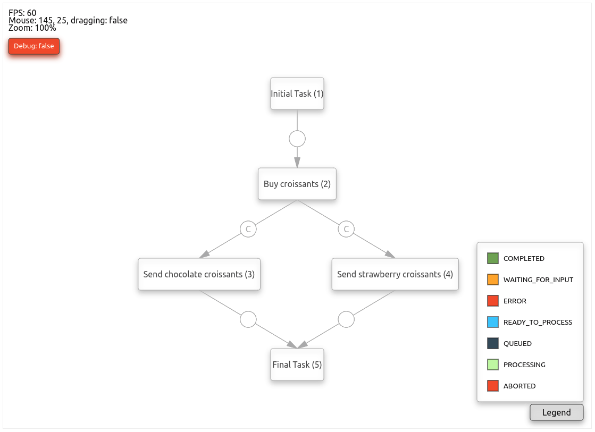

# FlowyUi

## What is it?
This repository contain's Flowy's default UI using React and HTML Canvas.

## Mandatory screenshot

## More complex description
Ideally the generic React/Canvas and its basic components will be extracted to a separate project but, for now, this code contains a way to render an animated canvas that can easily display primitives like boxes, circles, lines, arrow, more complex (compound) shapes like text boxes, buttons (clickable, hoverable), closeable and expandable panels, and also flowy specific components, like tasks, links, and information panels around those concepts. It also supports features like panning and zooming, as well as debugging shapes on mouse over.

The code also supports Websocket connections to the flowy backend which allow a user to see the workflows transitioning states in realtime, without having to refresh the web page. Still regarding the workflows themselves, the UI supports visualizing the code that is ran inside any task or link, as well as the ability to restart/resume tasks from the diagram.

## Core concepts/classes

- **drawable** : A single piece of graphics that can be drawn on a buffer. All other items directly or indirectly derive from this class. Contains information like the base position, the offset relative to the parent (in case of being a compose drawable), the width and height, the base color, whether it is to be drawn centered or left aligned, whether it is clickable or not, and a few more things. It also deals with panning position adjustments, and allows child drawables to be added or removed to and from it.
- **painter** : The class that deals with drawing the paint buffers in the correct order. Currently, flowy-ui has no notion of z-index or draw order, other than the fixed one that is defined (base buffer first, the all other custom buffers, and finally the ui buffer). This class also deals with delaying the addition or removal of drawables into a particular buffer as well as figuring out which drawable(s) to send click events to, based on the draw order. It also, obviously, holds all the buffers to be drawn.
- **paint_buffer** : A holder for drawables. Can be pannable, meaning that all drawables drawn on it will take into account the pan position. It also handles drawing debug information about the drawables it contains.
- **canvas** : The base react component that knows how to paint a scene in the canvas. Contains some debug information on itself (including the debug button), but in the end it's basically the canvas itself with support for animating X frames per second.
- **base_graph** : A derived class from canvas, that is specific to flowy. Knows how to draw tasks and links from a particular blueprint or instance. Also handles task and link selection.

## Folder hierarchy
Most of the code is javascript and is located under `app/assets/javascripts/flowy_ui`. The structure of that folder, as it stands, is as follows:

- **canvas/drawables** : Contains all code that is directly related to HTML canvas functionality, including all generic drawables, including base and compound.
- **canvas/events** : Contains the canvas event listener, which handles all things regarding clicks, scrolls, and other events happening on the canvas.
- **canvas/workflow** : Holds all drawables that are flowy specific (tasks, panels, links, legends, etc)
- **canvas/workflow** : Holds all drawables that are flowy specific (tasks, panels, links, legends, etc)
- **components** : Contains the React components that manage the canvas, including the flowy specific graphs (base_graph, blueprint_graph, and instance_graph), as well as support components to display things like source code, restart, resuming tasks, for instance using modals.

## License
The gem is available as open source under the terms of the [MIT License](https://opensource.org/licenses/MIT).
